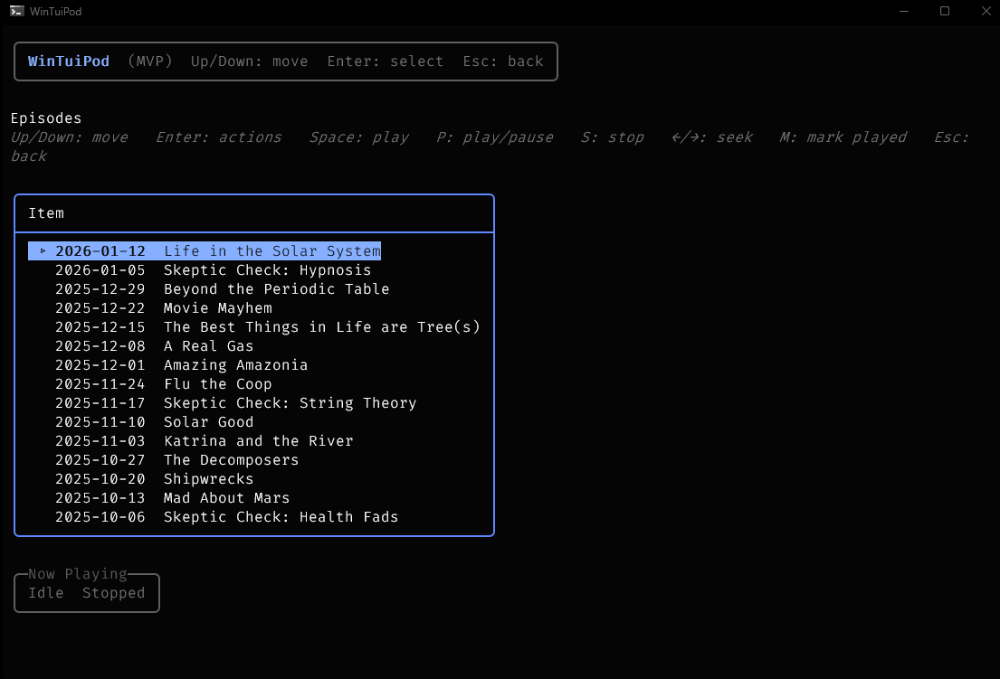
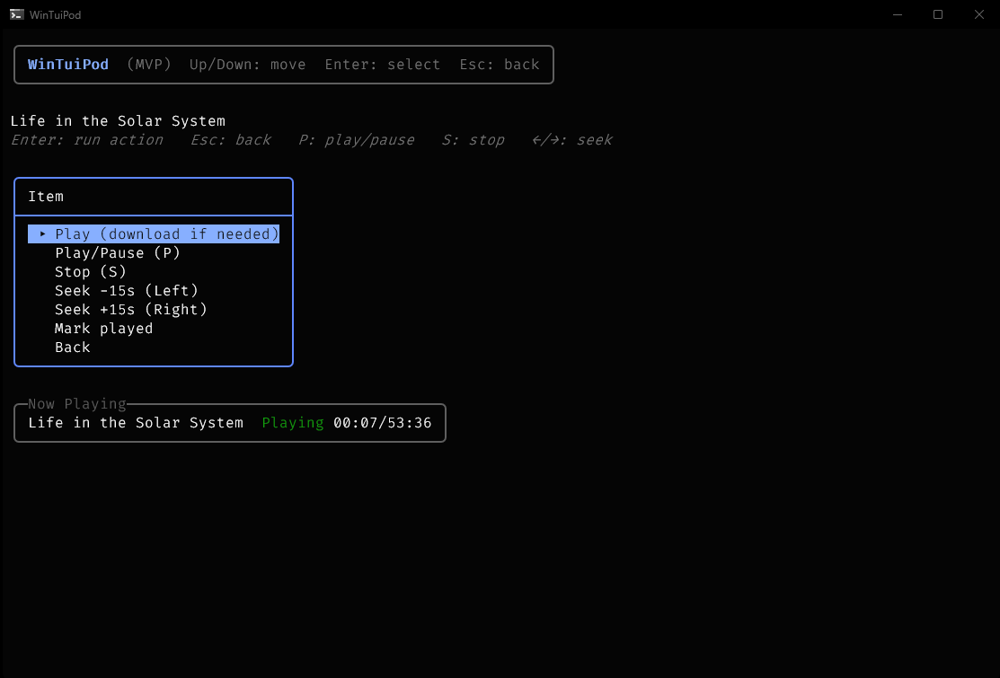

[](LICENSE)
[](https://github.com/dazlab/WinTuiPod/issues)

[](https://github.com/dazlab/WinTuiPod/actions/workflows/dotnet.yml)

If you’re like me, you spend a lot of time on the command line. On Linux, that’s second nature; terminal users are first-class citizens on *nix systems. 
On Windows, it’s still oddly uncomfortable— and the ecosystem of *native*, terminal-first tools is thin.

Podcast apps are a good example. There are plenty of GUI players, but virtually **no proper command-line podcast applications for Windows**.

**WinTuiPod** exists to fill that gap.

## What is WinTuiPod?

WinTuiPod is a terminal-based podcast client for Windows, built as a native TUI (Text User Interface).  
It is designed to be:

- Fully usable from the terminal  
- Keyboard-driven  
- Fast, lightweight, and distraction-free  
- Native to Windows (not a Linux port or WSL dependency)

No Electron. No browser UI. Just a clean terminal experience.

## Part of a TUI Suite

WinTuiPod is part of a small family of Windows-native TUI applications:

- **[WinTuiRss](https://github.com/dazlab/WinTuiRss)** — a terminal RSS reader for Windows  
- **[WinTuiNotes](https://github.com/dazlab/WinTuiNotes)** - a terminal notes management app
- **[WinTuiEditor](https://github.com/dazlab/WinTuiEditor)** — a simple, terminal-based text editor  
- **WinTuiPod** — podcasts, from the terminal

Each project focuses on doing one thing well, entirely from the command line, using a consistent approach and tooling.

## Why?

Windows has excellent terminals now— Windows Terminal, PowerShell, modern consoles— but the software ecosystem hasn’t caught up.

WinTuiPod is an attempt to prove that **terminal applications on Windows don’t have to feel like second-class citizens**.

## Status

This project is actively developed. Features, behaviour, and UI are still evolving.

Contributions, feedback, and bug reports are welcome.

## Screenshots
### Main Startup Screen


### Podcast Playlist


### Integrated Player


## Download

This project is currently in Alpha, but there is a version 0.1.0 x64 binary on the GitHub **Releases** page.

## Requirements

- For development: .NET 8 SDK
- For running: none if you use the self-contained release build (single EXE)

## Install (from source)

```powershell
git clone https://github.com/dazlab/WinTuiRss.git
cd WinTuiRss\WinTuiRss
dotnet restore
dotnet run
```

## License
MIT. 

See [License](LICENSE)

## Third-party notices
See [Third-party notices](THIRD-PARTY-NOTICES.md)x
